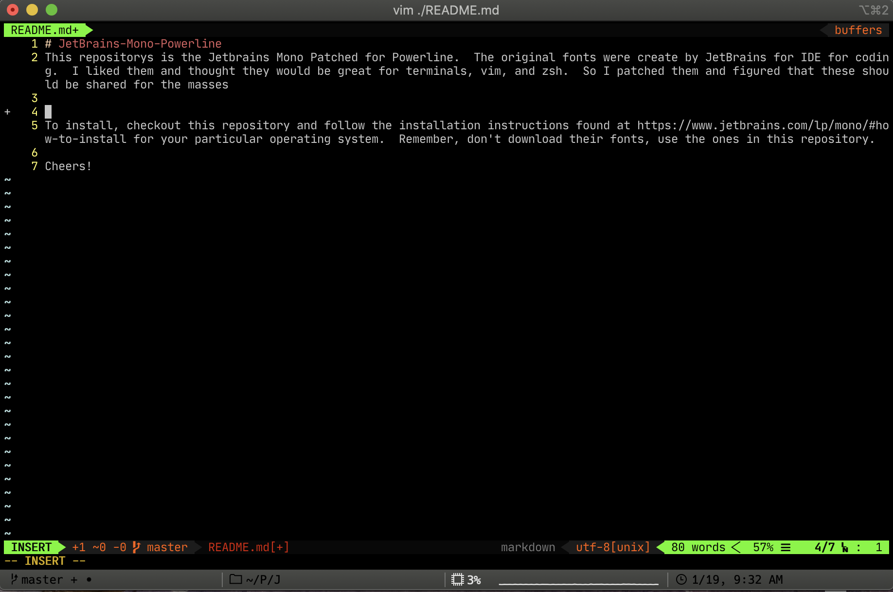

# JetBrains-Mono-Powerline

     
This repository is the Jetbrains Mono Patched for Powerline.  The original fonts were created by JetBrains for IDE for coding.  I liked them and thought they would be great for terminals, vim, and zsh.  So I patched them and figured that these should be shared for the masses

To install, checkout this repository and follow the installation instructions found at https://www.jetbrains.com/lp/mono/#how-to-install for your particular operating system.  Remember, don't download their fonts, use the ones in this repository.

Cheers!
